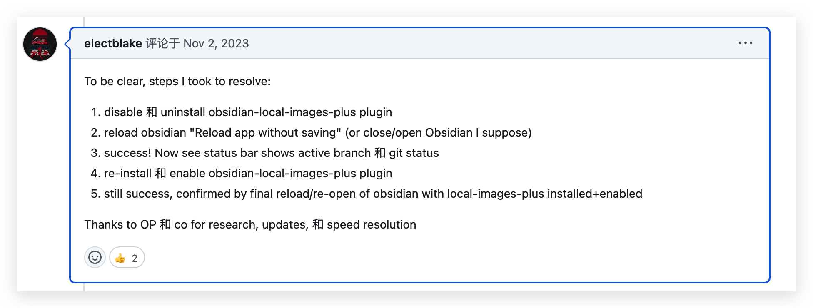

# Obsidian-git插件提交文件报错-「obsidian-git: error: Error: TypeError: Cannot read properties of undefined (reading 'isBuffer') 」

- 无法提交文件

问题排查
- [黑曜石Git-无法使插件正常工作:r / ObsidianMD](https://www.reddit.com/r/ObsidianMD/comments/17m3t1k/obsidian_git_cannot_get_plugin_to_work/?rdt=63822)
- [[Bug]: Git is not ready · 议题 #632 · Vinzent03/obsidian-git](https://github.com/Vinzent03/obsidian-git/issues/632#issuecomment-1790942996)

和插件obsidian-local-images-plus冲突导致

- 1、删除obsidian-local-images-plus插件。
- 2、重启Obsidian软件。
- 3、提交git，提交成功。
- 4、重新安装obsidian-local-images-plus
- 5、提交git，提交成功。

经过测试，确认删除obsidian-local-images-plus，再重装该插件解决问题。

